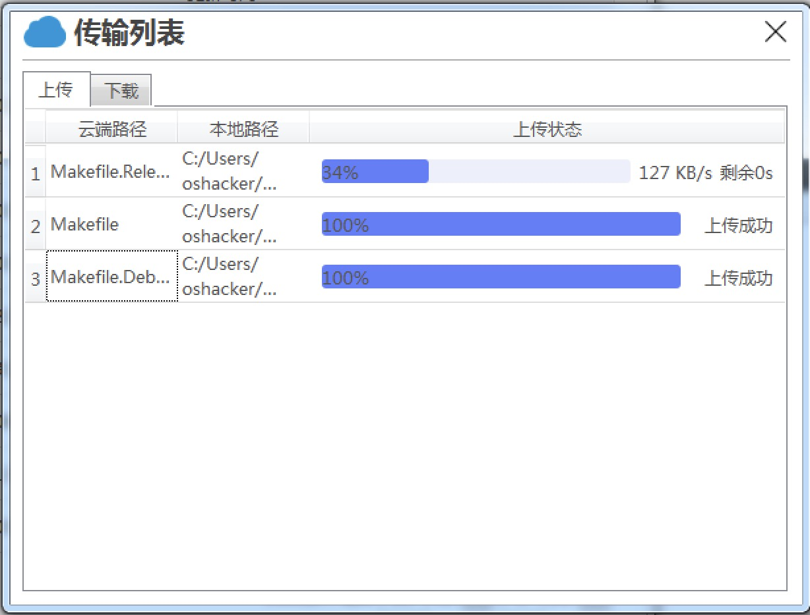

### 项目效果图如下

### 架构设计

- 插件思想
	- 日志插件设计
	- 对象存储插件设计

- 信息编码思想
	- 错误码编码
	- 版本编码

- 消息传播思想
	- 轮询（主动）
	- 订阅发布（被动）
	- 消息中心

- 隔离思想/分层思想
	- 前端
	- 网关
	- 后端

### 架构设计实践

- 目录结构

- 引入插件管理器进行版本管理
	- 一套代码分为商业版和个人版
		- 配置文件
		- 命令行

- 插件设计思想
	- 日志模块设计
		- 四要素原则
			- 时间：年月日 时分秒 毫秒
			- 地点：文件、行号、函数
			- 人物：什么对象
			- 事件：发生什么事情
		- 日志常见问题
			- 使用多线程时，每个线程都会打印日志到日志文件，如何保证日志打印的保证线程安全？
				- 加锁方式写日志
				- 使用第三方库
				- 自己封装QDebug
					- 资源如何同步？
					- 大文件数据如何打印？肯定不能放在主线程做
					- 线程标识？即如何区分是哪个线程打印的？
		- 使用单线程存储日志的代码
			- 安装日志插件
				- 基类BasicLogger，派生出LoggerQDebug
				- 在插件管理器中根据配置安装日志插件
			- 创建日志代理单例类
				- 使用宏传递文件、行号、函数名
					- 为什么必须用宏没太懂？？？
				- 调用统一的doLog方法，发送日志打印信号
			- 日志插件
				- 由BasicLogger的onLog槽函数连接LoggerProxy的写日志信号logSig
				- LoggerQDebug派生类重写print
			- QDebug拦截器
			  正常情况下，QDebug会将信息打印到控制台，这里我们要将信息打印到文件，所以进行了QDebug拦截器的编写
				- 编写LoggerQDebug::handle静态方法
				- 使用qInstallMessageHandler安装拦截器

- 网关
	- 网关的功能（鉴权<客户端不注重>、转发、限流、统计）类似海关的功能（合法、转发、限流、统计）
	- 转发
		- 当一个请求发到后端时，如果后端处理该请求耗时较长，就会造成前端界面的卡顿，所以增加转发的功能，将该请求转发给线程池中的一个线程，这样前端界面就不会卡顿，改善用户体验
	- 代码逻辑
		- 
			- 前端调用后端不涉及远程调用？？？

- 消息中心

	- 

		- 信号槽属于发布-订阅机制，但太多的信号槽会导致信号灾难，所以要成立消息中心（相当于村委会），所有发布的消息都经过消息中心，然后窗口订阅消息中心中的其关心的消息即可

	- 消息中心代码

		- 创建消息中心：定义单例，声明 登录、退出登录、错误 信号
		- 登录成功后 网关 发出登录成功的信号：谁关心，谁连接该信号（登录窗口、主窗口）
		- 登录失败后 网关 发出错误信号，谁关心，谁连接该信号（登录窗口）
		- 退出按钮 发出退出登录的信号：谁关心，谁连接该信号（登录窗口、主窗口）

- 全局管理模块

	- 单例类剧增问题

		- 使用单例来管理单例

			- 创建ManagerGlobal，将其他单例类删除，然后作为ManagerGlobal的数据成员
			- 迁移日志单例宏
			- 整理main方法中的代码

				- 初始化方法放到全局单例类中
				- 增加打印，验证单例释放内存

	- 完善 显示存储桶列表

		- 在ManagerCloud的login方法中直接调用setBucket方法会报如下错误：
......
QObject::connect: Cannot queue arguments of type 'QVector<int>'
(Make sure 'QVector<int>' is registered using qRegisterMetaType().)
QObject::connect: Cannot queue arguments of type 'QList<QPersistentModelIndex>'
(Make sure 'QList<QPersistentModelIndex>' is registered using qRegisterMetaType().)
......

			- setBucket方法中进行了model设置，设置后model就会和View通过信号槽进行通信，这个过程中就会传递QList<QPersistentModelIndex>等类型，而Qt信号槽机制并没有注册这样的类型，因此需要使用qRegisterMetaType进行注册

		- 使用qRegisterMetaType<MyClass>("MyClass")，通过信号传递容器或自定义类型

- 错误码编码设计

	- 错误码示例 1 c 05 a3
		- 1：角色（腾讯云）
		- c：类型（对象存储）
		- 05：接口大类型（上传）
		- a3：同步上传

	- 编码表设计
		- 第一行表示表头，共6位，后两位预留
		- 使用“描述_错误码”表示一个错误信息，空白单元格表示0
		- 每种错误类别应有一个默认错误，不确定错误就分类到该默认错误下
		- 补充说明字段表示使用预定义汉语不通顺的情况下使用

	- 错误码组件代码
		- 错误码报错机制
			- 后端接口入口处捕获异常，其他代码除非必要（比如重试），不允许捕获异常，只能抛出异常（code=异常编码，msg=预制信息+详细信息）

		- 错误码生成脚本
			- 遍历csv中的所有行，生成错误码头文件

### 后端开发

- SDK使用方法
	- 根据cos_api.h中的关键字，在SDK源码的UnitTest中搜索代码使用方法
	- SDK在线文档：通过cos_api.h中的链接直达 或 通过 控制台-常用工具-SDK下载-C++-快速入门 自己找

- 数据流在项目中的传递
	- 各个对象存储接口创建对应信号，后端执行完操作，发出对应信号到消息中心，关心该信号的前端响应该信号
	- 调用链

		- 

- 集成对象存储接口
	- 登录接口
	- 桶操作
		- 创建桶
			- 桶是否存在 isBucketExist
			- PutBucket
		- 删除桶
			- 桶是否存在 isBucketExist
			- DeleteBucket
			- 获取存储桶地域 GetBucketLocation
		- 桶列表

	- 对象操作
		- 对象列表
			- 对象与目录：页面上用目录的展示方式模拟了对象，实际不是目录。比如新建test/，实际上是新建了一个key为“test/”，值为空的对象
			- GetBucket
				- 
				- SetPrefix
				- SetDelimiter

		- 上传对象
			- AsyncPutObject
				- 参数：桶名称、key、本地路径、回调函数（上传的进度）
				- 回调函数参数：第一个表示已经传输了多少，第二个表示总共多大，第三个用户输入参数啥的

		- 下载对象
			- AsyncGetObject

- 单元测试

	- 企业中集成单元测试

		- 

	- 登录接口测试用例

		- 创建TestCos测试类
		- 引用登录方法的头文件
		- 引入其他依赖文件
		- 拷贝动态库、修改工作目录以配合cosconfig.json

	- 合并多个单元测试套件

		- 前面的单元测试存在的问题：需要维护多个测试工程
		- 解决办法：合并多个main函数

			- 创建main函数，将测试套件迁移至main函数
			- 添加头文件，修改源文件

	- 使用pri文件管理整个工程

		- 问题：项目代码和测试代码的pro内容很多是重复的，即多次添加头和源文件
		- 作用相当于一个子pro

			- 创建pri，将pro中的部分内容移动到pri中
			- 在pro中使用include()包含pri文件

		- 将pro按模块拆分成更小的“pro”，pro可以包含第三方库pri、后端文件pri、前端文件pri

	- 数据驱动单元测试

		- 数据准备阶段

			- 在单元测试用例函数后加“_data”
			- QTest::addColumn添加字段
			- QTest::newRow添加测试数据

		- 执行测试用例阶段

			- 从表格中读取数据，依次跑单元测试函数
			- QFETCH定义变量
			- QCOMPARE或其他判断方法，测试结果是否符合预期

	- 单元测试中处理预期异常

		- QVERIFY_EXCEPTION_THROWN，捕获预期异常

	- 单元测试小结

		- 用例准备

			- 所有

				- initTestCase，所有测试用例前执行
				- cleanupTestCase，所有用例后执行

			- 单个（没用到）

				- init，每个用例前执行
				- clean，每个用例后执行

			- 数据驱动

				- 同名测试方法名称后添加_data

		- 用例执行

			- private slots

				- 一个函数一个测试用例

			- SKIP

				- 跳过测试

			- 测试结果

				- 返回值

					- QVERIFY ，bool值判断
					- QVERIFY2，bool值判断，出错时，抛出提示信息
					- COMPARE，== bool判断

				- 异常

					- QVERIFY_EXCEPTION_THROWN，捕获预期异常

### 前端开发

- 界面设计

	- 目录结构设计

		- 前端单独一个目录
		- 前端目录至少包含：通用控件、主见面、子界面

	- 主界面代码逻辑结构设计

		- 合理划分主子界面原则

			- 聚类原则：拆分出所有控件，然后按功能组合子界面（功能统一的控件，放置在同一个子界面下）

			  注意：如果你得到的子界面和UI设计师给出的界面不一致，那么不是我们分类有问题，那么就是UI设计师的界面设计有问题，需要进行沟通对齐。
			  
			- 单一性原则：一个按钮只能有一个功能，不推荐根据不同的页面承担不同的功能

		- 主子界面划分结果

			- 存储桶列表

				- 搜索

			- 存储桶表格

				- 创建桶
				- 刷新
				- 翻页按钮

			- 对象操作

				- 刷新
				- 上传
				- 下载
				- 面包屑导航
				- 翻页按钮

			- 系统操作

				- 传输列表
				- 退出登录

		- 主子界面实现方法

			- 当主子界面划分清晰后，使用界面提升为一个单独的界面

- 公共组件开发

	- 基础窗口

		- UIBaseDialog，基础窗口

			- 基础窗口选型

				- QWidget、QDialog（支持弹出窗口）、QMainWindow（菜单栏、工具栏、边栏、状态栏等）

			- 基础窗口设计原则

				- 应包含所有窗口都需要的功能

					- logo、标题、按钮组（预定义和自定义）、拖动与调整窗口大小

				- 应抛开具体的项目，思考该组件可适用于其他项目

		- UiCosDialog，当前产品的基础窗口

			- 所有窗口都派生于它，以保证窗口风格相同

				- 登录窗口
				- 主窗口
				- 传输窗口

	- 面包屑导航

		- UiBreadWidget

			- 属性

				- QStringList m_names

			- 方法

				- 设置 set

					- 有效路径
					- 清空路径

				- 获取 get

					- 当前路径
					- 根目录名称

				- 判断 is

					- 当前路径是否为空
					- 当前是否为根目录

			- 信号

				- 思考内部变化

					- 只需要思考set方法，不管是设置路径还是清空路径

						- 路径变化

							- pathChanged

						- 路径不变

							- refresh

		- 使用QListView制作面包屑导航

	- 输入提示框

		- UiComboLine

		  以前是输入对应的内容才会弹出下拉提示，现在是点击登录输入框可直接弹出提示信息
		  
			- 属性

				- 提示文本列表

			- 方法

				- 设置提示列表
				- 获取提示列表

			- 信号

				- 提示条目被选中

		- 代码实现

			- 继承QLineEdit，重写mousePressEvent
			- 使用QCompleter进行提示

	- 翻页按钮

		- UiPageWidget

			- 需求

				- 总条数
				- 每页显示的最大行

					- 可切换显示行数

				- 页码切换

					- 向前一页，如果为第一页，则不可用
					- 向后一页，如果为最后一页，则不可用
					- 下拉菜单，直接跳转

			- 代码

				- 属性

					- 总条数、单页最大行数、当前页码、页数（可由总条数和单页最大行数算出，因此无此属性）

				- 方法

					- 总条数

						- set，设置总条数
						- get，获取总条数

					- 单页最大行数

						- set，设置单前显示的最大行，设置最大行列表
						- get，获取最大行

					- 当前页码

						- set

							- 向前翻页
							- 向后翻页
							- 设置当前页码
							- 设置页码列表

						- get

							- 获取当前页
							- 获取总页数

						- is

							- 是否是第一页
							- 是否是尾页

				- 信号

					- 设置总条数

						- 全部清空，重新设置（重置）

					- 设置单页最大行数

						- 设置当前显示的最大行

							- 由小到大（重置）
							- 由大到小（重置）

						- 设置最大行列表（重置）

					- 设置当前页码

						- 向前翻页
						- 向后翻页
						- 设置当前页码
						- 设置页码列表

	- 提示信息框

		- UiMessageBox

			- 为什么要自定义？

				- QMessageBox图标和按钮需要自定义，不符合统一的样式；异常提示信息框

			- 主界面异常处理

	- 公共组件设计原则

		- 独立原则，代码不依赖其他框架代码
		- 由简入繁：明确类含义->属性->方法->信号

- 功能界面开发

	- 登录
	- 主界面

		- 桶操作

			- 创建
			- 查询
			- 删除

				- 右键删除

		- 对象操作

			- 查询

				- 上钻
				- 下钻

			- 上传
			- 下载

	- 传输列表

		- 上传进度
		- 下载进度

- 功能界面开发实践

	- 原理

		- 

			- 代码编写方式：关注信号、发送请求、界面响应信号

	- 显示对象详情代码实现

		- 创建对象model

			- 修改model单例中的model为modelBuckets
			- 新建modelObjects

		- 调用显示对象详情接口

			- Gateway::send

		- 谁关心bucketsSuccess、objectsSuccess信号

			- ManagerModel
			- UiMain

		- 解决前面已经出现过的 自定义参数在信号中的传递 问题

			- 使用Q_DECLARE_METATYPE进行声明（没有好像也没问题）
			- 使用qRegisterMetaType进行注册

		- 从对象列表返回存储桶列表
		- 下钻和上钻

			- 下钻

				- 双击目录进入子目录
				- 发送展示对象详情请求
				- 关注展示对象详情的信号

			- 上钻

				- 通过面包屑导航实现

		- 翻页功能

			- 对象表格集成翻页

				- 初始化翻页实例，连接翻页信号
				- 展示指定数量的对象详情

			- 存储桶表格集成翻页

				- 同上

	- 搜素桶代码

		- 搜索框触发查询桶内容操作

			- 将单行输入框提升为ComboLine
			- 通过ComboLine的信号触发查询根目录的请求

		- 搜索框和桶列表实现筛选功能

			- 捕获ComboLine::textEdited 信号

	- 创建桶

		- 新建创建桶的Ui类

			- 创建Ui文件，继承自项目通用对话框
			- 点击对话框中的“确定”按钮后，通过该对话框能够获取到对应的存储桶信息（获取对话框结果）

		- 发送创建桶的请求

	- 删除桶

		- 删除桶，创建右键菜单
		- 弹出提示信息，确认后，发出删除桶的请求

	- 刷新操作

		- 刷新存储桶详情
		- 刷新对象详情

	- 上传和下载对象

		- 上传

			- 选择要上传的文件
			- 发送上传请求
			- 显示上传成功的消息

		- 下载

			- 同上传类似

	- 传输列表

		- UiMain

			- 创建传输列表
			- 显示传输列表

		- UiUpload/UiDownload

			- 初始化表格
			- 开始上传/下载
			- 显示进度
			- 显示完成
			- 上传/下载记录表添加异常处理

	- 功能界面开发注意事项

		- 单一原则：槽函数（关注者）只做自己该做的事，比如UiMain::onObjectsSuccess
		- 信号自定义参数：使用Q_DECLARE_METATYPE进行声明，用qRegisterMetaType进行注册

- 前端代码的阅读方法

	- 搜索信号，找到信号发出处，按连接信号的槽去阅读

### 界面美化

- 样式表叠加与冲突的解决方案

	- 不同选择器，匹配到了相同的控件

		- 不同属性

			- 叠加显示

		- 相同属性

			- 谁特殊（优先级高），谁优先
			- 同样特殊，新（后）覆盖旧（前）

- 美化对象存储所有控件

	- QPushButton

		- 所有按钮

			- 登录

				- 登录按钮

			- 标题栏

				- 最大/最小化/关闭
				- 传输列表
				- 退出登录

			- 桶表格界面

				- 创建桶
				- 刷新
				- 翻页按钮

			- 对象表格界面

				- 桶列表
				- 刷新
				- 上传/下载
				- 翻页按钮

		- 按钮分类

			- 普通按钮

				- 刷新/上传/下载

					- 使用QPushButton进行通用设置

			- 系统按钮

				- 最大/最小...

			- 加强按钮

				- 登录/创建桶/桶列表

					- 使用系统属性进行特殊化处理

		- 按状态美化

			- 添加disabled伪状态
			- 为所有按钮添加手指手势

	- 视图QAbstractItemView

		- 列表QListTable

			- 存储桶列表

				- 去除边框
				- 增加item之间的间隔
				- 鼠标悬停/选中时，背景透明灰色，文字为蓝色

			- 面包屑

				- 鼠标悬停，鼠标变为手形

		- 表格

			- QTableVIew（桶和对象表格）

				- 去除边框和竖线

					- 在Ui设计师界面去除网格线

						- showGrid去掉勾选

					- Qss去除边框

				- 增加行之间的间隔

					- Qt的bug：Qss无法增加间隔（行高），需使用代码实现

				- 鼠标悬停/选中，整行背景浅灰色、文字蓝色

					- 鼠标选中整行而非item

						- selectionBehavior设为SelectRows

					- Qss只能实现鼠标悬停，item hover的效果；无法实现鼠标悬停，整行hover的效果，需要用代码 代理item 实现

						- 继承QStyledItemDelegate
						- 重写paint方法
						- 调用QTableView::setItemDelegate进行设置生效

					- Qss实现背景浅灰色、文字蓝色

			- QTableWidget（传输列表）

				- 大部分同QTableView
				- 不同点：在新增行时，设置行高

			- 使用QAbstractItemView统一Qss中上面各种View的样式

		- 图标

			- 桶前面加图标
			- 对象前面加图标（文件夹/文件）

	- 输入提示框的下拉列表（QListView)

		- 复用QListView的样式

			- 复用TableItemDelegate实现

				- QAbstractItemView::setItemDelegate进行设置生效

		- 手形鼠标

	- 进度条/滚动条

		- Qss设置

- 美化步骤总结

  以QPushButton为例
  0、全局设置：选择器*，字体、文字颜色、背景色
  1、罗列控件：按类型罗列控件，对样式进行分类
  2、分类控件：通用类、加强显示类、特殊、状态
  3、设置默认样式：直接使用类名QPushButton
  4、使用style设置特殊样式：类名[属性=“”]，比如style_button
  5、使用状态设置样式：hover、disabled
  6、配合代码共同完成样式美化
  
### 整合发布

- 先忽略，需要再说吧

